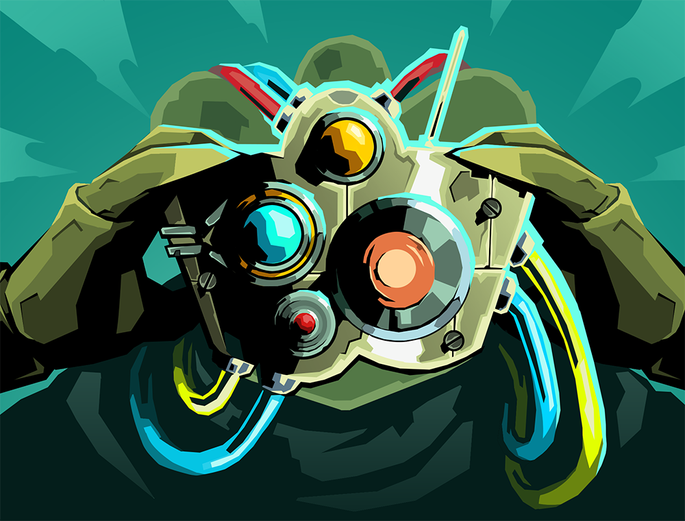

# Defect Overhaul - STS2 Mod

[English](README.md) | [简体中文](README.zhs.md)

Gameplay overhaul for the Defect character.

## Current Features

- Modified 31 [Cards](docs/eng/CARDS.md).
- Modified some game mechanics:
  - Defect Regain Orb Slot: When enabled, Defect regains an Orb Slot upon Channelling a new Orb with no Orb Slots, aligning with other characters.
- Every modification can be dependently toggled with RitsuLib's in-game config.
- Supports English and Simplified Chinese localization.

## Dependencies

Requires [STS2-RitsuLib](https://github.com/BAKAOLC/STS2-RitsuLib).

## Installation

1. Download `DefectOverhaul-<version>.zip` from the [Releases](https://github.com/RaymondBlaze/DefectOverhaul/releases).
2. Extract the contents into STS2's `mods` directory.
3. Install `STS2-RitsuLib` following it's [README](https://github.com/BAKAOLC/STS2-RitsuLib/README.md).
4. Launch the game and enable both mods in the settings.

## Building from Source

- Environment: .NET 9.0 / Godot 4.5 / STS2 installed.
- `git clone` the repository.
- Create `godot/local.props` from the template, configure STS2 and Godot paths.
- Run `dotnet build godot/DefectOverhaul.csproj`.
- Mod and `STS2-RitsuLib` automatically deploys to STS2's `mods` directory, also creates a release ZIP under the project's `build` directory.
