# 故障机器人重置 - 卡牌

## 适应打击

<table><tr>
  <td>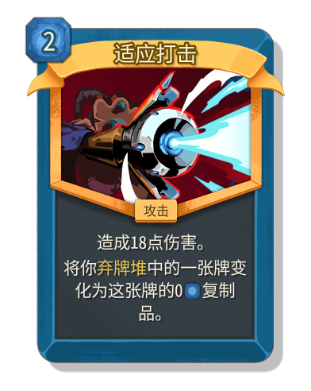</td>
  <td>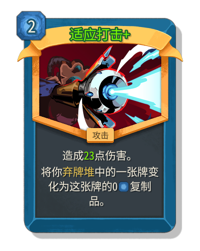</td>
</tr></table>

## 弹幕齐射

<table><tr>
  <td>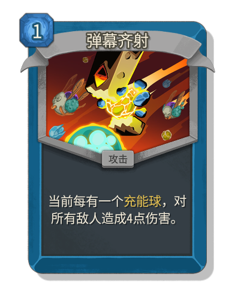</td>
  <td>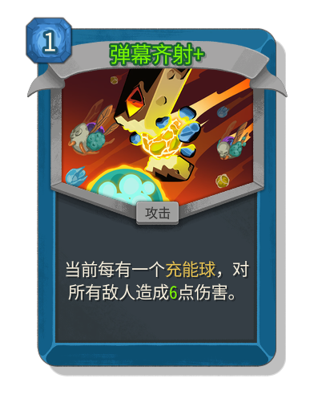</td>
</tr></table>

## 寒流

<table><tr>
  <td>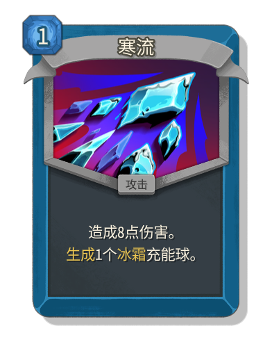</td>
  <td>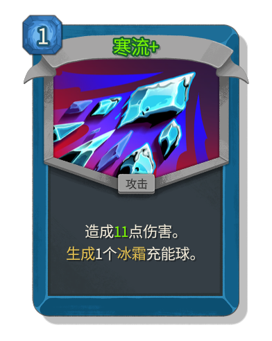</td>
</tr></table>

## 吞噬暗影

<table><tr>
  <td>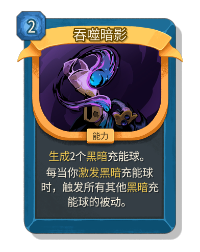</td>
  <td>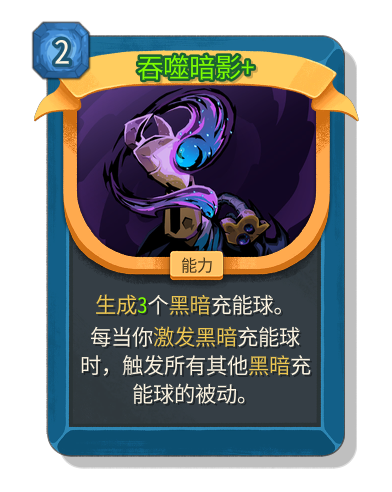</td>
</tr></table>

## 冷却剂

<table><tr>
  <td>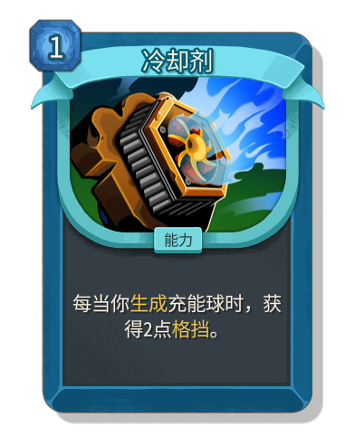</td>
  <td></td>
</tr></table>

## 碎片整理

<table><tr>
  <td>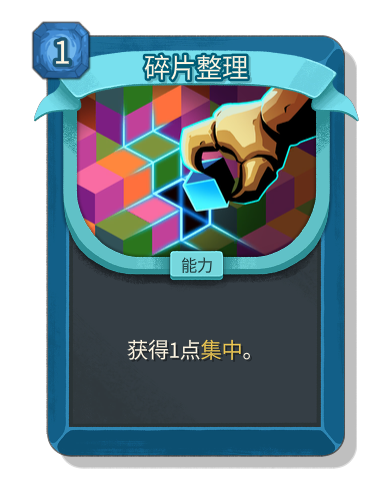</td>
  <td></td>
</tr></table>

## 野性

<table><tr>
  <td>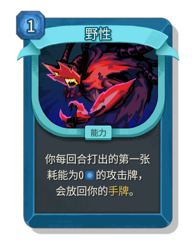</td>
  <td>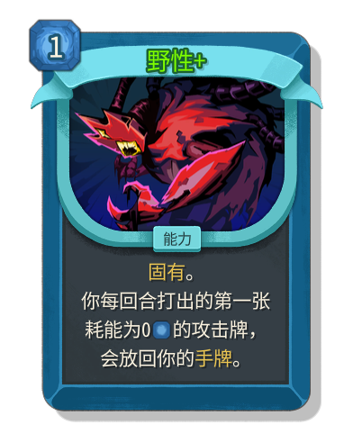</td>
</tr></table>

## 超越光速

<table><tr>
  <td>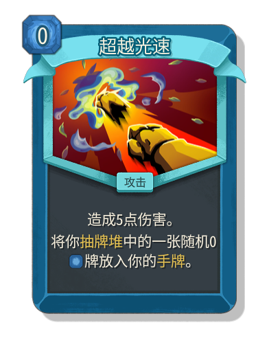</td>
  <td>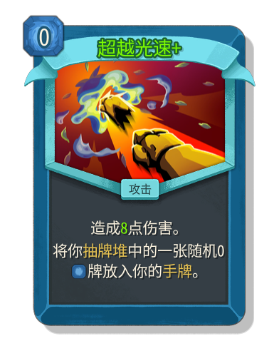</td>
</tr></table>

## 冰川

<table><tr>
  <td>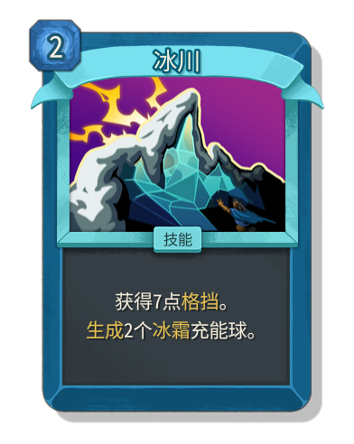</td>
  <td>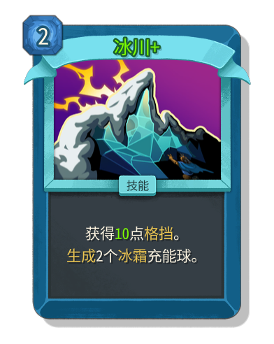</td>
</tr></table>

## 冰雹风暴

<table><tr>
  <td>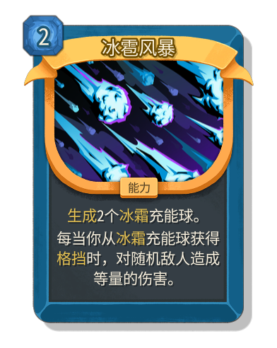</td>
  <td>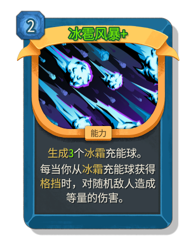</td>
</tr></table>

## 螺旋钻击

<table><tr>
  <td>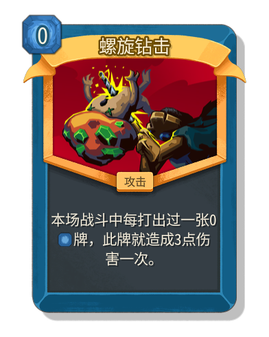</td>
  <td>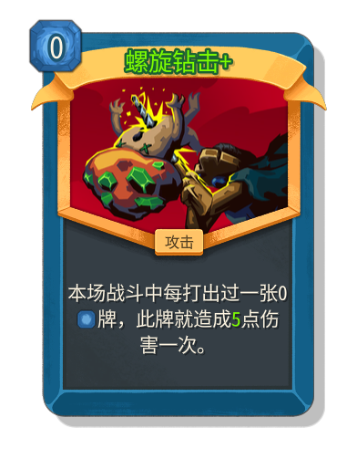</td>
</tr></table>

## 热修复

<table><tr>
  <td>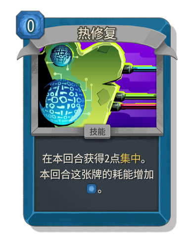</td>
  <td>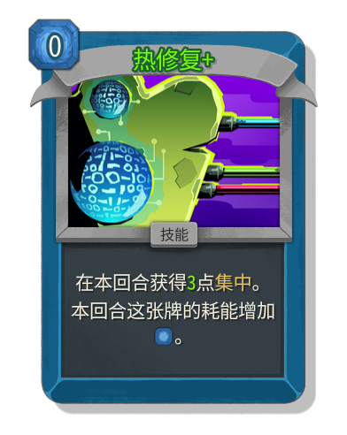</td>
</tr></table>

## 冰之长枪

<table><tr>
  <td>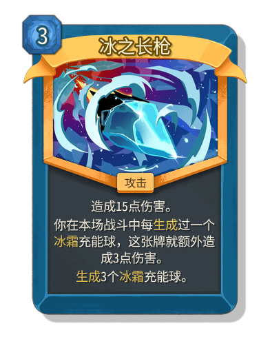</td>
  <td>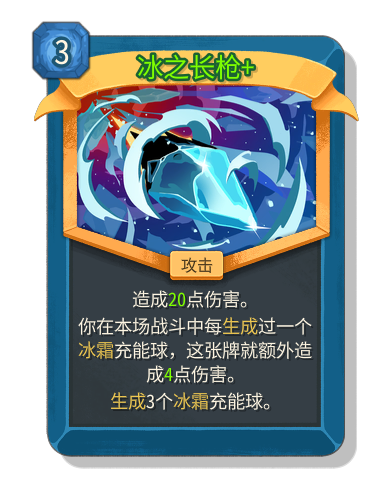</td>
</tr></table>

## 迭代

<table><tr>
  <td></td>
  <td>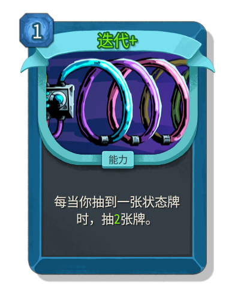</td>
</tr></table>

## 飞跃

<table><tr>
  <td>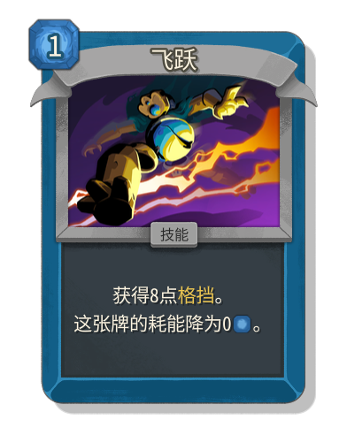</td>
  <td>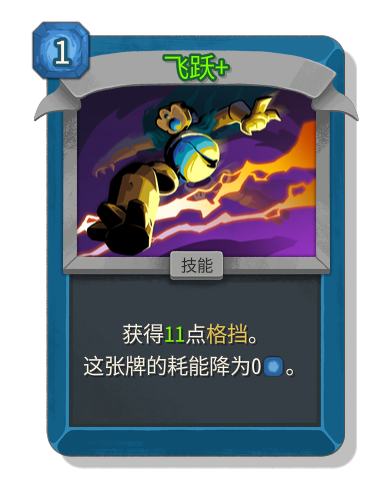</td>
</tr></table>

## 循环

<table><tr>
  <td>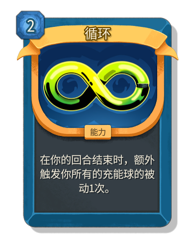</td>
  <td>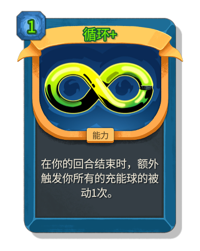</td>
</tr></table>

## 彩虹

<table><tr>
  <td>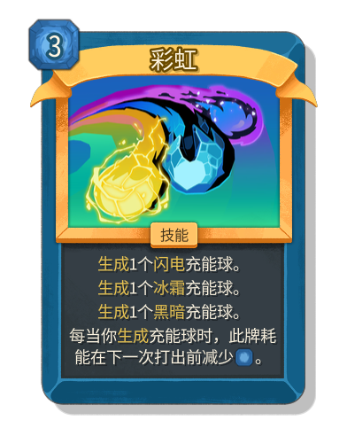</td>
  <td>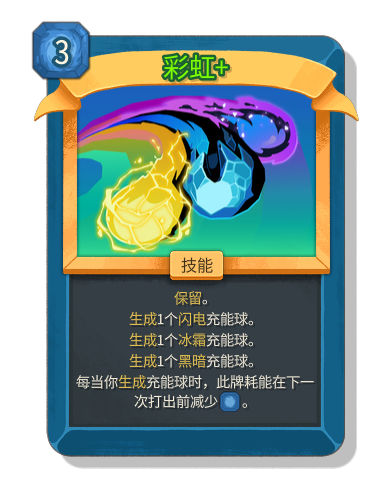</td>
</tr></table>

## 折射

<table><tr>
  <td>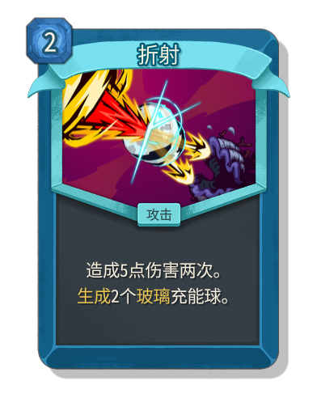</td>
  <td>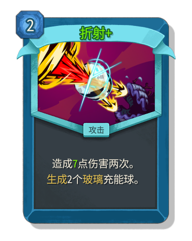</td>
</tr></table>

## 信号增强

<table><tr>
  <td>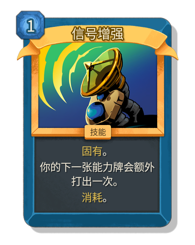</td>
  <td>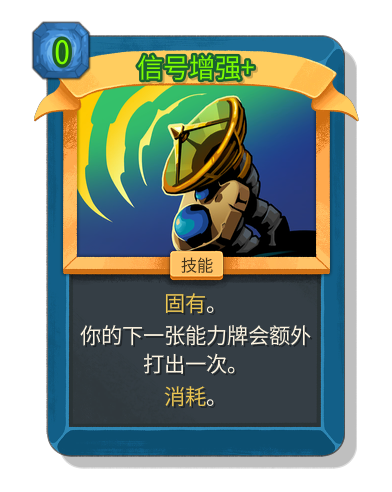</td>
</tr></table>

## 烟囱

<table><tr>
  <td>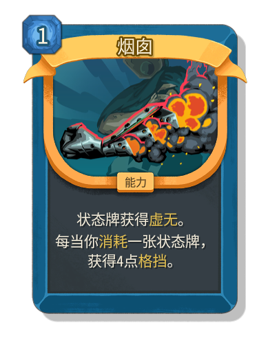</td>
  <td>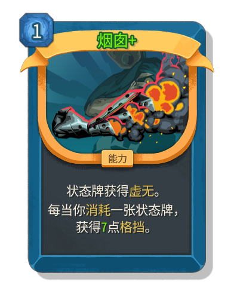</td>
</tr></table>

## 旋转工艺

<table><tr>
  <td>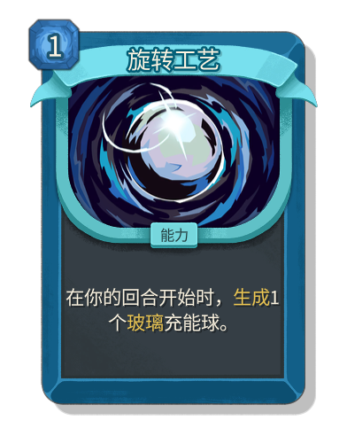</td>
  <td>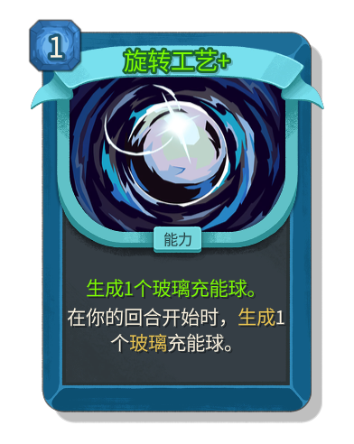</td>
</tr></table>

## 雷暴

<table><tr>
  <td>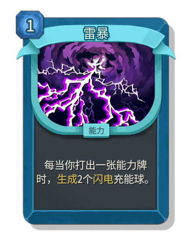</td>
  <td>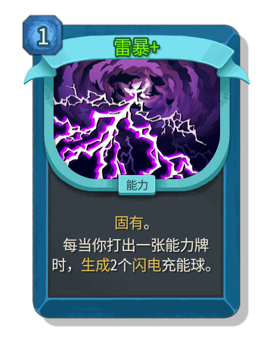</td>
</tr></table>

## 扫荡射线

<table><tr>
  <td></td>
  <td>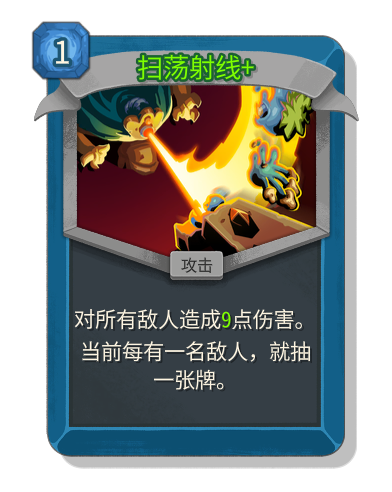</td>
</tr></table>

## 骚动

<table><tr>
  <td>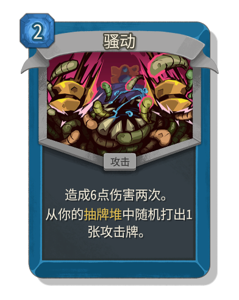</td>
  <td>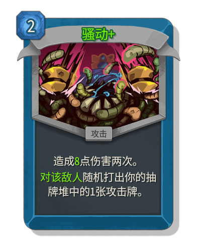</td>
</tr></table>
